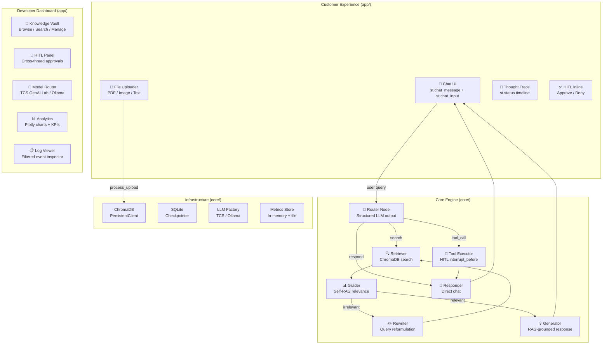
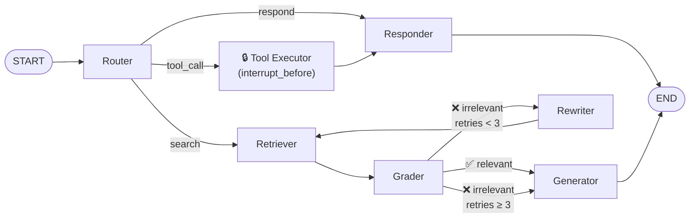

# CoreAgent Framework Architecture Documentation

## 1. Introduction

CoreAgent is a production-grade, modular AI agent framework designed to orchestrate complex, stateful workflows. It bridges the gap between conversational AI and deterministic enterprise infrastructure by providing a clear separation of concerns between its user-facing frontend and its agentic backend. 

Powered by **Streamlit**, **LangGraph**, **LangChain**, and **ChromaDB**, CoreAgent supports multi-modal interactions, Agentic RAG with query reformulation (Self-RAG), Human-in-the-loop (HITL) authorization, and robust observability.

---

## 2. Architecture Overview



---

## 3. Graph Topology



---

## 4. Directory Structure

```
CoreAgent-2/
├── .env.example                      # Environment template
├── .gitignore
├── .streamlit/config.toml            # Streamlit config (dark theme, no auto-nav)
├── requirements.txt                  # 15 dependencies
├── run.py                            # Convenience launcher
│
├── app/                              # ── Streamlit UI Layer ──
│   ├── main.py                       # Entry point, routing, theme injection
│   ├── pages/
│   │   ├── chat.py                   # Customer chat interface
│   │   └── dev_dashboard.py          # Admin dashboard (5 tabs)
│   ├── components/
│   │   ├── chat_interface.py         # Message rendering
│   │   ├── thought_trace.py          # Agent reasoning timeline
│   │   ├── file_uploader.py          # Document ingestion
│   │   ├── hitl_panel.py             # HITL approval UI
│   │   ├── knowledge_vault_ui.py     # ChromaDB Browse/Search/Manage
│   │   ├── analytics_panel.py        # Plotly charts + KPIs
│   │   ├── model_router_ui.py        # Dynamic model switching
│   │   └── log_viewer.py             # Filterable event inspector
│   └── styles/
│       └── theme.css                 # 260+ lines of glassmorphic CSS
│
├── core/                             # ── Backend Logic (API-agnostic) ──
│   ├── config.py                     # Centralized settings + model catalogs
│   ├── graph/
│   │   ├── state.py                  # AgentState TypedDict
│   │   ├── orchestrator.py           # StateGraph builder + compiler
│   │   ├── nodes/
│   │   │   ├── router.py             # Intent classification
│   │   │   ├── retriever.py          # RAG retrieval
│   │   │   ├── grader.py             # Self-RAG grading
│   │   │   ├── rewriter.py           # Query reformulation
│   │   │   ├── generator.py          # Context-grounded generation
│   │   │   ├── responder.py          # Direct chat
│   │   │   └── tool_executor.py      # Tool invocation (HITL)
│   │   └── edges/
│   │       └── conditionals.py       # route_query, grade_documents
│   ├── knowledge/
│   │   ├── vault.py                  # ChromaDB CRUD + search
│   │   ├── loaders.py                # PDF/Image/Text processing
│   │   └── embeddings.py             # Embedding model factory
│   ├── llm/
│   │   └── provider.py              # LLM factory (TCS GenAI Lab / Ollama)
│   ├── tools/
│   │   ├── registry.py               # Tool registration
│   │   ├── knowledge_search.py       # Knowledge Vault search tool
│   │   └── web_search.py             # Web search placeholder
│   ├── memory/
│   │   └── checkpointer.py           # SQLite checkpointer
│   └── observability/
│       └── logger.py                 # Structured logging + MetricsStore
│
├── tests/
│   ├── test_graph.py                 # Graph integration tests ✅
│   └── test_knowledge_vault.py       # CRUD + search tests
│
└── data/                             # Persistent data (gitignored)
    ├── chroma_db/
    ├── checkpoints/
    └── uploads/
```

---

## 5. Key Design Decisions

| Decision | Choice | Rationale |
|:---|:---|:---|
| **Default LLM** | TCS GenAI Lab (`DeepSeek-V3-0324`) | Lab environment default; switchable at runtime |
| **Embeddings** | TCS GenAI Lab (`text-embedding-3-large`) | Matches LLM provider; Ollama `Gte-large` as fallback |
| **Checkpointer** | SQLite (not MemorySaver) | Production-grade persistence across browser refreshes |
| **Auth** | Sidebar toggle | MVP approach; easy to gate with password later |
| **State persistence** | `interrupt_before=["tool_executor"]` | HITL for all tool executions |
| **Self-RAG limit** | 3 retries max | Prevents infinite grader-rewriter loops |
| **CSS approach** | 260+ line custom `theme.css` | Full glassmorphic dark theme overriding all Streamlit defaults |

---

## 6. How to Run

```bash
cd /home/labuser/Desktop/CoreAgent-2

# 1. Copy .env and set your API key
cp .env.example .env
# Edit .env → set TCS_GENAI_API_KEY

# 2. Install dependencies (if not already done)
python -m pip install -r requirements.txt

# 3. Launch
python run.py
# or: PYTHONPATH=. streamlit run app/main.py
```

---

## 7. Test Results

```
✅ Graph builds successfully.
✅ AgentState schema is valid.
✅ Conditional edges work correctly.
✅ Tool registry works correctly.

🎉 All tests passed!
```

---

## 8. Next Steps

1. **Set the API key** in `.env` → `TCS_GENAI_API_KEY=your_key_here` to enable LLM calls
2. **Upload a PDF** via the sidebar to populate the Knowledge Vault
3. **Ask a question** about the uploaded document to trigger the full RAG pipeline
4. **Switch to Dev Mode** to explore the dashboard tabs
5. **Future**: Wrap `core/` in a FastAPI layer for API-first deployment
